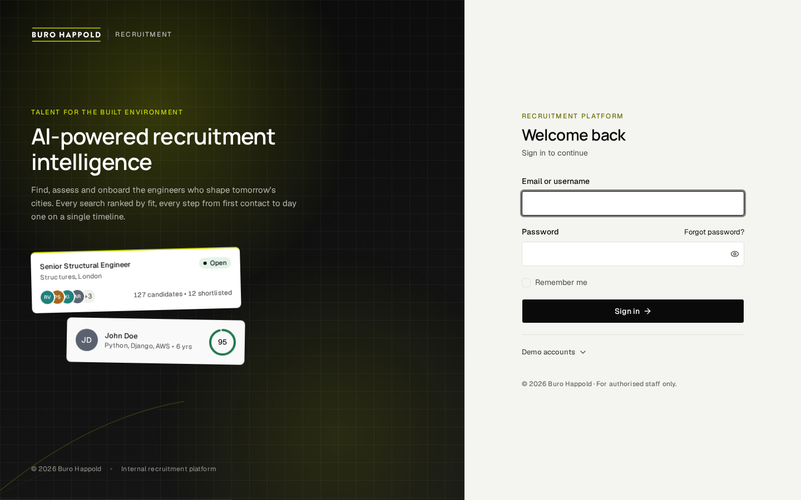
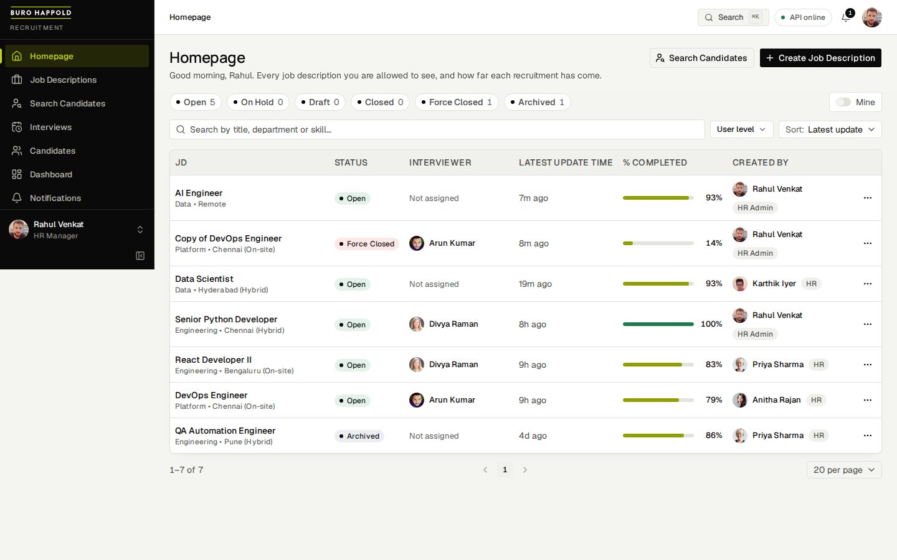
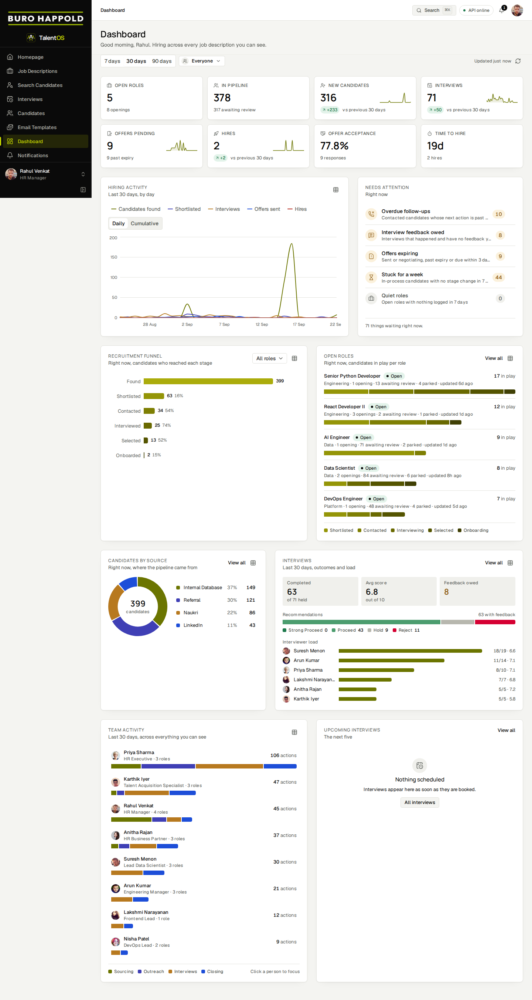
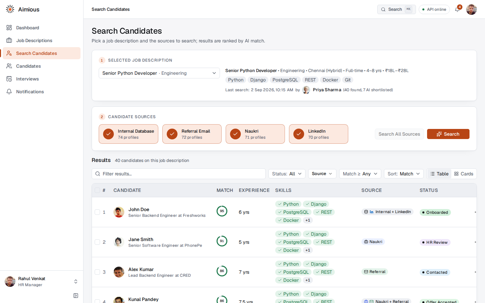
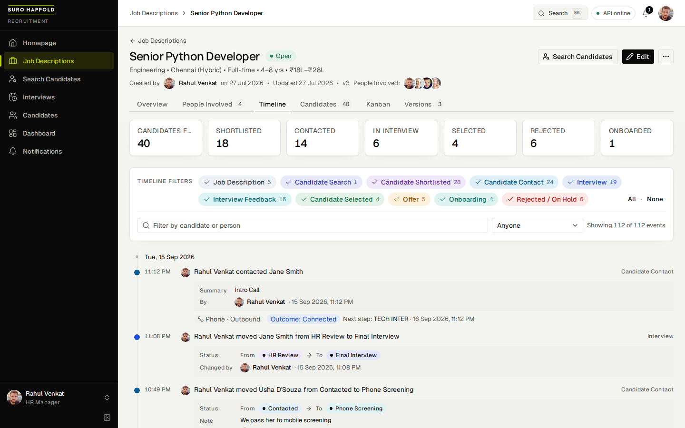
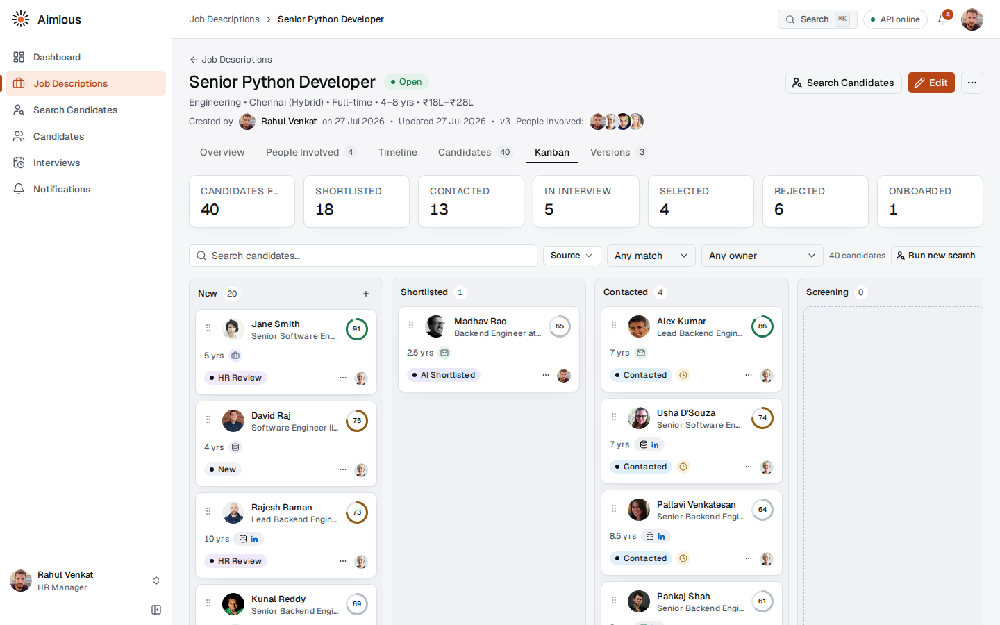
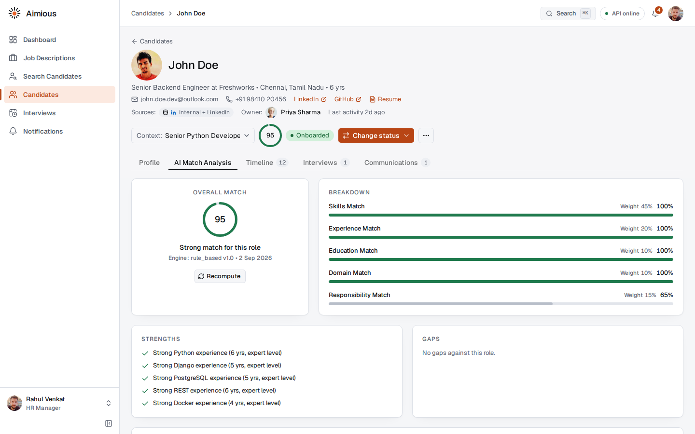
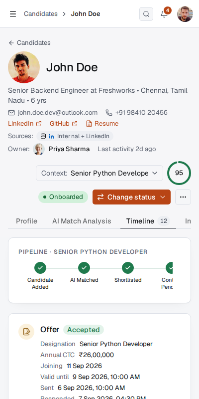
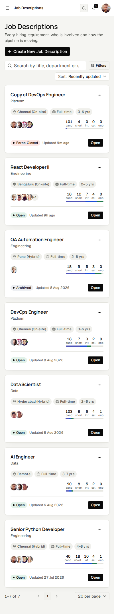

# Buro Happold Recruitment Platform

A demo-ready recruitment platform built for Buro Happold (the Aimious engine underneath) that walks the full hiring journey: sign in, create a Job Description with the people involved in the recruitment, search candidates across pluggable sources (internal pool, referrals, mock Naukri and LinkedIn), rank them with an explainable AI match percentage, and move each one through contact, interviews, selection, offer and onboarding on a Kanban board. Every important action is stored in PostgreSQL and shows up on a filterable timeline with who did it and when.

Django + Django REST Framework serve a JSON API under `/api/v1/`; a Vite + React + TypeScript SPA styled with Tailwind CSS v4 and shadcn/ui consumes it. External integrations are mock providers behind a stable interface, so real Naukri, LinkedIn, referral email and an LLM matcher can be plugged in without restructuring.

- [plan.md](plan.md): the full specification (decisions, data model, API, page designs, seed data, build phases).
- [ARCHITECTURE.md](ARCHITECTURE.md): how the code is layered, the request flows, and where to plug in real integrations.

## Screenshots

| | |
|---|---|
|  |  |
| Login on the Buro Happold graphite panel, with one-click demo accounts | Homepage: every job description with status, interviewer, latest update, completion and the row actions |
|  |  |
| Dashboard (HR admins and HR): headline figures with sparklines, the hiring activity trend, what needs attention, the funnel, open roles, sources, interview outcomes, team activity and upcoming interviews, scoped by a 7/30/90-day window and optionally to one person | Search Candidates: the search panel, the AI loading experience and ranked results with match rings |
|  |  |
| Job Description timeline with category filter chips | Kanban board with drag and drop, dialog-first columns and the parked tray |
|  |  |
| Candidate detail: AI Match Analysis with breakdown, strengths and gaps | Candidate timeline with the stage stepper at 400px |
|  | |
| Job Descriptions as cards at 400px, navigation in a drawer | |

## Quick start (local development)

Requirements: Python 3.12, Node 24, Docker (for PostgreSQL).

```bash
make setup      # copies .env, creates backend/.venv, installs Python and npm deps
make db-up      # starts PostgreSQL 16 + pgvector in Docker on host port 5434
make migrate    # applies Django migrations
make seed       # loads the deterministic demo data set (about 20 seconds)
make dev        # Django API on 8200 + Vite dev server on 5175 (Ctrl-C stops both)
```

Open <http://localhost:5175> and sign in with a demo account below. `make help` lists every target.

### Resume library (OpenAI or Gemini)

Chat calls default to OpenAI and automatically try **`OPENAI_MODEL` (`gpt-4.1-mini`) → `OPENAI_FALLBACK_MODEL` (`gpt-4o-mini`) → `GEMINI_MODEL`** after errors. This covers resume parsing, JD analysis, candidate evaluation, outreach and call conversations. Set both `OPENAI_API_KEY` and `GEMINI_API_KEY` in the git-ignored `.env`. Each new call starts with OpenAI again; a successful answer stops the chain. `LLM_MAX_RETRIES=0` moves immediately to the next model, while higher values retry each model first. `LLM_PROVIDER=gemini` remains available with its own `GEMINI_FALLBACK_MODEL`. The whole PDF, job brief or candidate excerpt can be sent to a fallback provider when an earlier attempt fails.

Embeddings use the fixed `EMBEDDING_PROVIDER` (defaults to `LLM_PROVIDER` at startup), independently of chat fallback. **For an existing Gemini-indexed library, set `EMBEDDING_PROVIDER=gemini` and keep `EMBEDDING_MODEL=gemini-embedding-001` when switching chat to OpenAI.** This preserves compatibility with stored search vectors. Restart the backend after changing `.env`.

```bash
# set both API keys and EMBEDDING_PROVIDER in .env, point RESUME_STORAGE_PATH at a folder of PDFs, then:
cd backend && .venv/bin/python manage.py ingest_resumes               # everything in the folder (already-ingested files are skipped by hash)
cd backend && .venv/bin/python manage.py ingest_resumes --reprocess   # re-send everything, e.g. after changing the provider or embedding model
cd backend && .venv/bin/python manage.py upload_resumes               # once the S3 credentials are in .env
```

The **PDF itself is sent** to the model, which returns the whole structured profile, so a scanned resume -- which has no text for anything else to read -- parses as well as a typed one. The first `RESUME_LLM_PDF_MAX_PAGES` pages (12) go, which bounds what a page-billed provider can cost on a document that turns out to be a portfolio; over the cap the extra pages are dropped and the document says so. The extracted text layer is never used for a field; it is only the candidate's searchable text, and a scan with no text layer is indexed on text rebuilt from the model's answer. When a model fails, the shared fallback chain tries the next model, and the document records the actual provider and model that answered. A PDF the model cannot read, or that cannot be sent, is flagged `needs_review` with the reason and retried automatically the next time `ingest_resumes` runs over the same folder, while everything already parsed is skipped by hash, so nothing is paid for twice. **Embeddings stay on `EMBEDDING_PROVIDER`** (`text-embedding-3-small` on OpenAI, `gemini-embedding-001` on Gemini, both at the 768-dimension width baked into the pgvector column), so a change of embedding provider or model is followed by `ingest_resumes --reprocess`.

**Contacting candidates.** On the search results and a job's Candidates tab, **Contact Candidates** offers Email, WhatsApp and Phone (the last two are listed as coming soon). Choosing Email turns on the row tick boxes; the recruiter ticks candidates and presses Send. The same compose dialog opens from a row's "Email candidate…" action and from a candidate's Communications tab. In it HR staff can start from a template (managed on the **Email Templates** page, seeded with an introduction) or let the AI draft one from a purpose, tone, role and free instructions, edit the text with placeholders, preview it as any recipient, optionally save it as a new template, and send. Each candidate gets the text filled in with their own details. Every send is logged as an outbound email in the contact log and on the timeline, and moves a New / AI Shortlisted candidate to Contact Pending. Mail goes out through SMTP when `EMAIL_HOST` is set (Zoho, Gmail, SES all work); with it empty the mail is printed in the server log. While `EMAIL_SAFE_RECIPIENT` is set every mail is redirected to that inbox with the intended recipient in the subject, so the flow can be tested against real resumes without writing to anyone.

**AI phone calls.** Contact Candidates also offers **Phone call (AI)**. The recruiter picks the purpose, a friendly **knowledge test** (their own questions first, then questions drawn from the job description, one follow-up whenever an answer is vague) or **sharing information** ("your interview is today at 5 pm"), types the questions or the message, and sets a maximum length. The script and the assessment run on the project LLM; a **simulated call** runs the same interview as a chat in the browser so it can be tested with no telephony account, and a real call goes through a voice provider (`VOICE_PROVIDER=vapi` with a Vapi key, number id and a public `PUBLIC_BASE_URL` for its webhooks; `VOICE_SAFE_NUMBER` redirects every real call to one number until go-live). Every call is logged as a phone contact with the transcript, a summary and per-question scores, and a completed knowledge test moves the candidate to Phone Screening. The **AI Calls** tab on the candidate page shows them.

HR staff can also upload PDFs from the browser: **Candidates → Upload resumes** (`POST /api/v1/resumes/uploads/`, any number of files) validates and de-duplicates them, queues them through the same pipeline on a server worker thread, and shows each file's live status. Every PDF becomes a candidate (or refreshes an existing one, matched by email or phone), its text lands on the profile, and its sections are embedded into pgvector -- and when the PDF is a scan, that text is rebuilt from the model's structured answer, so the candidate is searchable like any other instead of sitting in the library with no vectors. On the Search page these candidates belong to the **Internal Database** source, the company's own talent pool: the job description is analysed by the LLM, the ingested resumes are searched semantically, filtered by the structured requirements, and the top candidates are reviewed by the LLM with a grounded explanation. Runs execute in the background and the page shows live progress. Ingestion is one model call per PDF plus the embeddings; a search runs a few LLM reviews (`SEMANTIC_RERANK_LIMIT`) on top of the vector query.

**Job description uploads.** On **Job Descriptions → Create from a file**, upload one PDF or DOCX (up to 10 MB). The upload banner follows you across pages, with **Cancel upload** available during transfer and AI processing. Once reading finishes, **Review job description** opens the extracted fields; no job is created until you save. Processing status and completed results are stored per user and restored after a browser refresh. The API reserves the upload at `POST /api/v1/job-description-uploads/`, accepts its file at `/{id}/file/`, and supports `/{id}/cancel/` and `/{id}/dismiss/`. Processing uses a server worker thread: a backend restart does not resume that worker; cancel the interrupted upload and upload again.

## One-command demo (Docker)

```bash
make demo
```

Builds the API image (gunicorn + whitenoise, `DEBUG=false`, non-root) and the web image (nginx serving the Vite build and proxying `/api`), starts PostgreSQL, API and web, applies migrations, seeds the demo data and prints the accounts. The UI is at <http://localhost:8201>, the API docs at <http://localhost:8200/api/docs/>. `make docker-down` stops the stack (`KEEP_DATA=0 make docker-down` also drops the database volume).

## Demo accounts

Every password is `Demo@1234`. Emails are `<firstname>@aimious.demo`.

| Name | Role | Designation |
|---|---|---|
| Rahul Venkat | HR admin | HR Manager |
| Priya Sharma | HR | HR Executive |
| Karthik Iyer | HR | Talent Acquisition Specialist |
| Anitha Rajan | HR | HR Business Partner |
| Arun Kumar | Interviewer | Engineering Manager |
| Divya Raman | Interviewer | Senior Software Engineer |
| Suresh Menon | Interviewer | Lead Data Scientist |
| Nisha Patel | Interviewer | DevOps Lead |
| Vikram Shah | Employee | Product Manager |
| Lakshmi Narayanan | Employee | Frontend Lead |

Sign in as Rahul for the full experience. Arun sees masked candidate contact details and can submit feedback on his own interviews. The login page lists these accounts with one-click fill (the demo accounts keep their `@aimious.demo` addresses).

## The demo walk-through

The sidebar groups Homepage and Dashboard (HR admins and HR only) under Main, then Job Descriptions, Search Candidates, Interviews, Candidates and Email Templates under Recruiting, then Notifications and Support under General; signing in lands on the Homepage.

1. **Homepage**: your job descriptions as a work table (JD, status, interviewer, latest update, % completed). HR admins and HR toggle **Mine** off to see everyone's work, filter by **User level**, and use the row menu to **Add comment** (lands on the JD timeline) or **Force close** (with a confirmation; the JD becomes *Force Closed*).
2. **Dashboard** (HR admins and HR only; interviewers and employees never see it): eight headline figures with sparklines and deltas against the previous window, the hiring activity trend, what needs attention, the recruitment funnel, open roles, candidates by source, interview outcomes, team activity and upcoming interviews. A 7/30/90-day window and a person picker scope every figure; every chart flips to a table.
3. **Support**: raise a ticket (subject, category, priority, an optional related role and the details) and get a number like `SUP-1009`. The list shows every ticket you raised or were assigned (HR admins see all of them) with status chips, search, priority and category filters; the ticket page has the description, the resolution, a timeline of every comment, assignment and status change, and exactly the buttons you may use (start work, resolve, close, reopen, assign). Every step notifies the requester, the assignee and, until someone picks it up, the support team.
4. **Job Descriptions**: table or card view with filters. Open **Senior Python Developer**, the richest pipeline.
5. **Create a Job Description**: skills as tag inputs, and the **People Involved in the Recruitment** picker that adds colleagues with a role in the recruitment.
6. **Timeline tab**: toggle the category chips (Job Description, Candidate Search, Candidate Shortlisted, Candidate Contact, Interview, Interview Feedback, Candidate Selected, Offer, Onboarding, Rejected / On Hold). Every event reads in plain language: changes show **From → To**, the reason given, and who made the change.
7. **Search Candidates**: pick the JD, choose sources, run the search. While it runs, the AI loading experience rotates through what the system is doing; results are ranked by match with skill chips that highlight matched and missing required skills. Shortlist in bulk.
8. **Candidate detail**: profile, **AI Match Analysis** (five weighted components, strengths, gaps, skill coverage), the stage stepper timeline, interviews and communications. **John Doe** carries the complete journey that ends onboarded. Every status change confirms the current and new status and requires a reason.
9. **Kanban tab**: drag a card forward. Interview, Offer and Onboarding columns open their dialog first; every other drop opens the status confirmation. Every move lands on the timeline.
10. **Interviews**, **Notifications** (bell with unread count), **Settings** (profile, security, preferences; users list for admins). The **Back** control on every detail page returns to the page you came from.

## Ports

| Service | Dev (host) | Docker demo (host) |
|---|---|---|
| PostgreSQL | 5434 | 5434 |
| Django API | 8200 | 8200 |
| Vite dev server | 5175 | not used |
| nginx serving the built SPA | not used | 8201 |

Vite proxies `/api` to the Django API in dev; nginx does the same in Docker, so the SPA always calls a same-origin `/api/v1/...`.

## Configuration

Everything comes from the repo-root `.env` (copied from [.env.example](.env.example) by `make setup`). The variables you are most likely to change:

| Variable | Default | Effect |
|---|---|---|
| `AI_SHORTLIST_THRESHOLD` | `80` | Overall match at or above this becomes "AI Shortlisted" |
| `CANDIDATE_SOURCE_PROVIDERS` | `internal,referral,naukri,linkedin,resume` | Which providers the Search page offers |
| `RESUME_STORAGE_PATH` | `<repo>/resumes` | Folder `ingest_resumes` scans for PDFs |
| `LLM_PROVIDER` | `openai` | Initial chat provider. OpenAI tries its second model, then Gemini, on errors; PDFs are sent directly so scans parse too |
| `OPENAI_MODEL` / `OPENAI_FALLBACK_MODEL` | `gpt-4.1-mini` / `gpt-4o-mini` | First and second OpenAI chat models; empty fallback skips the second model |
| `LLM_MAX_RETRIES` | `0` | Retries per model before advancing through the fallback chain |
| `RESUME_LLM_PDF_MAX_PAGES` | `12` | Pages of a PDF sent to the model; over the cap the first 12 go and the document records a warning |
| `RESUME_LLM_PDF_MAX_MB` | `14` | Size ceiling for that request once the page cap is applied, set from Gemini's 20 MB inline-data limit less the base64 expansion (14 MiB → 18.7 MiB on the wire); over it the document is `needs_review` |
| `OPENAI_API_KEY` / `GEMINI_API_KEY` | empty | Backend keys for the primary and fallback providers |
| `EMBEDDING_PROVIDER` | `LLM_PROVIDER` | Fixed embedding provider, unaffected by chat fallback; pin to the provider of existing vectors |
| `EMBEDDING_MODEL` / `EMBEDDING_DIMENSIONS` | per provider / `768` | `text-embedding-3-small` on OpenAI, `gemini-embedding-001` on Gemini; the width is baked into the pgvector column, and changing the model means `ingest_resumes --reprocess` |
| `SEMANTIC_RERANK_LIMIT` | `4` | Top candidates the LLM reviews per search (each costs one LLM call) |
| `SEARCH_RUN_ASYNC` | `true` | Searches run in a background thread; the UI polls the run |
| `RESUME_S3_BUCKET`, `AWS_ACCESS_KEY_ID`, `AWS_SECRET_ACCESS_KEY` | empty | S3 for the PDFs; empty = uploads deferred, "Open resume" explains why |
| `MATCH_ENGINE` | `rule_based` | Engine key; a Claude-backed engine is the planned next step |
| `SEED_ANCHOR_DATE` | `2026-09-11` | The day seeded timelines end on |
| `JWT_REFRESH_REMEMBER_DAYS` | `14` | Refresh cookie lifetime with "Remember me" |

## Quality checks

```bash
make lint        # ruff, import-linter layering contracts, ESLint (zero warnings), Prettier
make typecheck   # tsc
make test        # pytest (backend) and Vitest (frontend)
make openapi     # regenerate frontend/src/types/api.d.ts from the DRF schema
make audit       # pip-audit and npm audit
```

The backend layering rule (views → services → repositories/providers/engines → models) is enforced by import-linter in `make lint`.

## Repository layout

```
backend/    Django project: config/, common/, accounts/, jobs/, candidates/, pipeline/,
            sourcing/, matching/, resumes/, activity/, notifications/, audit/, dashboard/, seed/, tests/
frontend/   Vite + React + TypeScript SPA: src/app, src/lib, src/components, src/features
scripts/    dev.sh (runs Postgres + API + Vite together)
docs/       screenshots used above
```

## What is deliberately mocked

Naukri, LinkedIn and referral email are providers that read a seeded pool from PostgreSQL. No email is sent (forgot-password records a request and returns 202). Seeded candidates carry resume text with a placeholder link; ingested PDFs are real, parsed and embedded by the configured `LLM_PROVIDER`, and open from S3 once the credentials are configured. See ARCHITECTURE.md section 4 for how each of these becomes real.
